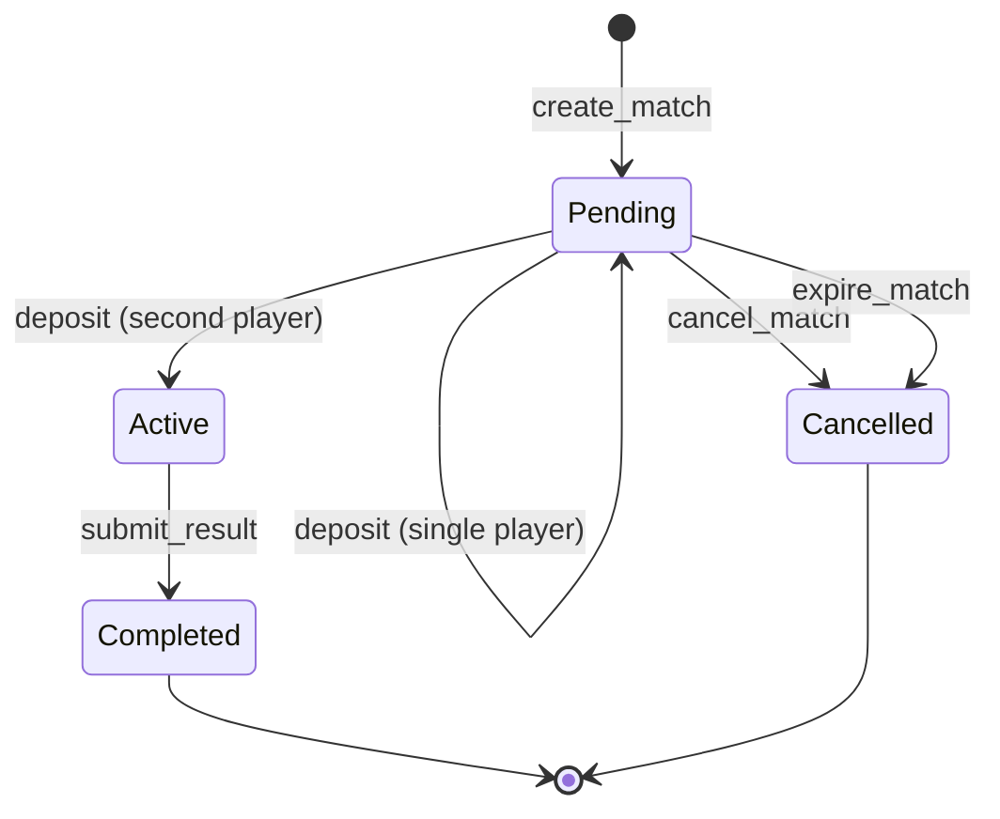

# Architecture Overview

Checkmate-Escrow is a trustless chess wagering platform built on Stellar Soroban smart contracts. This document describes the high-level architecture and the stable public API surface.

## Components

```
┌─────────────┐     create/deposit/cancel     ┌──────────────────┐
│   Players   │ ─────────────────────────────▶│  Escrow Contract │
└─────────────┘                               └────────┬─────────┘
                                                       │ submit_result
┌─────────────┐     verify game result                 │
│   Oracle    │ ─────────────────────────────▶─────────┘
└─────────────┘
      │
      │ polls
      ▼
┌──────────────────────┐
│  Lichess / Chess.com │
└──────────────────────┘
```

- **Escrow Contract** (`contracts/escrow`): Holds player stakes, enforces match lifecycle, and executes payouts.
- **Oracle Contract** (`contracts/oracle`): Bridges external chess platform APIs to the escrow contract, submitting verified match results on-chain.

## Match Lifecycle



### Transition Reference

| From | To | Triggering Function | Authorized Caller | Conditions | Key Errors |
|---|---|---|---|---|---|
| `*` | `Pending` | `create_match` | `player1` | Contract not paused; `stake_amount > 0`; `game_id` non-empty and unique; token on allowlist (if enforced). | `ContractPaused`, `InvalidAmount`, `Al[...]
| `Pending` | `Pending` | `deposit` | `player1` or `player2` | Match exists; contract not paused; caller has not already deposited; transfers `stake_amount` to escrow. | `ContractPaused`, `MatchNo[...]
| `Pending` | `Active` | `deposit` | `player1` or `player2` | Same as above, **and** this deposit completes funding (both `player1_deposited` and `player2_deposited` are now `true`). | (same as si[...]
| `Pending` | `Cancelled` | `cancel_match` | `player1` or `player2` | Match is in `Pending` state; refunds any deposited stakes. | `MatchNotFound`, `MatchAlreadyActive`, `Unauthorized` |
| `Pending` | `Cancelled` | `expire_match` | Anyone | Match is in `Pending` state; ledger timeout (`MatchTimeout`, default ~24h) has elapsed since `created_ledger`; refunds any deposited stakes. |[...]
| `Active` | `Completed` | `submit_result` | Oracle address stored at initialization | Match is in `Active` state; contract not paused; both players have deposited; oracle auth required. **Payout [...]
| `Completed` | — | — | — | Terminal state. No further transitions. | — |
| `Cancelled` | — | — | — | Terminal state. No further transitions. | — |

> **Note:** `execute_payout` is not a separate external function in the current implementation. The escrow contract pays out atomically inside `submit_result`.

## Stable Public API

The following types and contract functions are considered stable. External integrations and tooling should rely only on these.

### `Match` Struct

Returned by `get_match(match_id)`. All fields below are stable and safe to read.

| Field              | Type            | Description |
|--------------------|-----------------|-------------|
| `id`               | `u64`           | Unique match identifier. |
| `player1`          | `Address`       | Match creator (first player). |
| `player2`          | `Address`       | Invited opponent (second player). |
| `stake_amount`     | `i128`          | Amount each player stakes, in the token's smallest unit. |
| `token`            | `Address`       | Token contract address used for staking (XLM or USDC). |
| `game_id`          | `String`        | External game ID from the chess platform. |
| `platform`         | `Platform`      | Chess platform: `Lichess` or `ChessDotCom`. |
| `state`            | `MatchState`    | Current lifecycle state (see below). |
| `winner`           | `Winner`        | Match outcome once completed; defaults to `Draw` until set. |
| `created_ledger`   | `u32`           | Ledger sequence at match creation. |
| `completed_ledger` | `Option<u32>`   | Ledger sequence at completion or cancellation, if applicable. |

> **Internal fields** — `player1_deposited` and `player2_deposited` are internal bookkeeping. Use `is_funded(match_id)` to check whether a match is fully funded.

### `MatchState` Enum

| Variant     | Meaning |
|-------------|---------|
| `Pending`   | Match created; awaiting both deposits. |
| `Active`    | Both players deposited; game in progress. |
| `Completed` | Result submitted and payout executed. |
| `Cancelled` | Cancelled before activation; stakes refunded. |

### `Winner` Enum

| Variant   | Meaning |
|-----------|---------|
| `Player1` | Player 1 won. |
| `Player2` | Player 2 won. |
| `Draw`    | Game ended in a draw; stakes returned to both players. |

### `SnapshotReason` Enum

| Variant     | Meaning |
|-------------|---------|
| `Created`   | Snapshot taken when match was created. |
| `Deposit`   | Snapshot taken after a player deposited. |
| `Completed` | Snapshot taken when match completed with payout. |
| `Cancelled` | Snapshot taken when match was cancelled. |

### `BalanceSnapshot` Struct

Balance snapshots provide an audit trail of a match's escrow balance at key lifecycle transitions. The contract uses a fixed-size ring buffer to store these records efficiently.

| Field              | Type            | Description |
|--------------------|-----------------|-------------|
| `match_id`         | `u64`           | The match this snapshot belongs to. |
| `index`            | `u32`           | Monotonically increasing position in the full chronological sequence. Storage keys are computed as `slot = index % MAX_SNAPSHOTS_PER_MATCH` (8). May have [...]
| `reason`           | `SnapshotReason`  | Lifecycle event that triggered the snapshot: `Created`, `Deposit`, `Completed`, or `Cancelled`. |
| `ledger`           | `u32`           | Ledger sequence at snapshot time. |
| `token`            | `Address`       | Token contract address used for staking. |
| `token_symbol`     | `String`        | Human-readable token symbol (e.g., "XLM", "USDC"). |
| `stake_amount`     | `i128`          | Per-player stake amount at snapshot time. |
| `escrow_balance`   | `i128`          | Total tokens held in escrow at snapshot time. |
| `player1_deposited`| `bool`          | Whether player1 had deposited. |
| `player2_deposited`| `bool`          | Whether player2 had deposited. |

### Balance Snapshots

Snapshots are recorded automatically at key lifecycle transitions:
- **`Created`** — when `create_match` is called (initial state: zero deposits)
- **`Deposit`** — each time a player deposits their stake
- **`Completed`** — when `submit_result` executes the payout
- **`Cancelled`** — when cancellation occurs (before or after activation)

The ring buffer has a fixed capacity of `MAX_SNAPSHOTS_PER_MATCH = 8` slots per match. Snapshots are stored at keys `DataKey::Snapshot(match_id, slot)` where `slot = index % MAX_SNAPSHOTS_PER_MAT[...]

**Interpreting the `index` field:** The `index` is monotonically increasing and never resets, enabling callers to detect when pruning has occurred. If `get_balance_snapshots` returns snapshots wi[...]

### Contract Functions

#### Match Management

| Function | Signature | Description |
|----------|-----------|-------------|
| `create_match` | `(player1: Address, player2: Address, stake_amount: i128, token: Address, game_id: String, platform: Platform) -> u64` | Creates a new match and returns its ID. |
| `get_match` | `(match_id: u64) -> Match` | Returns the current state of a match. |
| `cancel_match` | `(match_id: u64)` | Cancels a match and refunds any deposits. |

#### Escrow

| Function | Signature | Description |
|----------|-----------|-------------|
| `deposit` | `(match_id: u64)` | Deposits the caller's stake into escrow. |
| `get_escrow_balance` | `(match_id: u64) -> i128` | Returns the total escrowed balance for a match. |
| `is_funded` | `(match_id: u64) -> bool` | Returns `true` when both players have deposited. |

#### Oracle & Payouts

| Function | Signature | Description |
|----------|-----------|-------------|

| `submit_result` | `(match_id: u64, winner: Winner)` | Oracle submits the verified match result. Payout (or draw refund) is executed atomically in the same transaction — there are no separate [...]

#### Read Indexes

| Function | Signature | Description |
|----------|-----------|-------------|
| `get_player_matches` | `(player: Address) -> Vec<u64>` | Returns all match IDs (past and present) for a player. |
| `get_pending_matches` | `() -> Vec<Match>` | Returns pending matches currently in `Pending` state, awaiting deposit completion. |
| `get_active_matches` | `() -> Vec<Match>` | Returns active matches currently in `Active` state, fully funded and ready for result submission. |
| `get_pending_matches_paginated` | `(player: Address, offset: u32, limit: u32) -> Vec<Match>` | Paginated version of `get_pending_matches`. |
| `get_active_matches_paginated` | `(offset: u32, limit: u32) -> Vec<Match>` | Paginated version of `get_active_matches`. |

#### Balance Snapshot Queries

| Function | Signature | Description |
|----------|-----------|-------------|
| `get_balance_snapshots` | `(caller: Address, match_id: u64) -> Vec<BalanceSnapshot>` | Returns all retained snapshots for a match. Admin sees exact amounts; players see redacted amounts. |
| `get_latest_snapshot` | `(caller: Address, match_id: u64) -> BalanceSnapshot` | Returns the most recent snapshot for a match. Same access rules as `get_balance_snapshots`. |

## Index Behavior, TTL Caveats, and Pagination

### Player-Match Index (`get_player_matches`)

`get_player_matches` reads a `Vec<u64>` stored under `DataKey::PlayerMatches(player)` in persistent storage. The index is append-only: a match ID is added when `create_match` is called and is **n[...]

- The list grows monotonically over a player's lifetime.
- It includes `Completed` and `Cancelled` matches as well as live ones.
- To determine a match's current state, call `get_match(match_id)` for each ID.

### Pending-Match Query (`get_pending_matches`)

`get_pending_matches` scans all created matches and returns those currently in `Pending` state. A pending match has been created but has not yet reached full funding; it may have zero, one, or bo[...]

### Active-Match Query (`get_active_matches`)

`get_active_matches` scans all created matches and returns those currently in `Active` state. An active match is fully funded and ready for result submission. It excludes pending, completed, and [...]

> **Note:** Because these query methods scan per-match storage, off-chain consumers should still verify a match's current state with `get_match(match_id)` before taking critical action.

### TTL Caveats

`get_player_matches` is a persistent append-only index stored under `DataKey::PlayerMatches(player)`. The index is updated on `create_match` and carries a TTL of `MATCH_TTL_LEDGERS` (~30 days at [...]

`get_pending_matches` and `get_active_matches` are filtered getters that scan all `Match` records by state. They do not rely on separate persistent index entries and therefore reflect current mat[...]

Individual `Match` records in persistent storage follow the same ~30-day TTL and are extended on every write to that match.

Off-chain indexers should not rely solely on these on-chain values for long-term history. Subscribe to contract events (`match.created`, `match.result`, `match.cancelled`) for a durable record.

### Pagination

`get_pending_matches` and `get_active_matches` return the full filtered result set in a single call. Use `get_pending_matches_paginated(player, offset, limit)` or `get_active_matches_paginated(of[...]

`get_player_matches` also returns the full vector of match IDs for a player. For large player histories, apply client-side slicing on the returned `Vec<u64>`.

```rust
// Example: fetch page of 20 starting at offset 40
let all_ids = client.get_player_matches(&player);
let page: Vec<u64> = all_ids.iter().skip(40).take(20).collect();
```

## Glossary

This glossary defines terms used throughout this repository and clarifies how they're used in the context of Checkmate-Escrow.

- Ledger
  - In Stellar, a ledger is a single committed state of the network (a block of transactions). Each ledger has a monotonically increasing sequence number. In this project we record `created_ledger` and `completed_ledger` to timestamp on-chain events and to implement TTL/timeout checks (e.g., `expire_match` compares the current ledger sequence against a stored ledger + TTL).

- TTL (Time-To-Live)
  - TTL is the duration a storage entry is retained on-chain, expressed in ledger counts in this project (e.g., `MATCH_TTL_LEDGERS` ≈ 30 days worth of ledgers). When a record's TTL expires the Soroban host may prune it; writing to a record typically extends its TTL.

- Instance Storage
  - Instance storage refers to storage scoped to a specific contract instance (the contract's own on-chain key-value entries). These are the per-match and per-contract data entries the contract reads and writes at runtime. Instance storage entries may be subject to TTL and pruning rules.

- Persistent Storage
  - Persistent storage denotes the durable on-chain key/value entries that the contract intentionally maintains across transactions (e.g., `DataKey::PlayerMatches(player)`, `Match` records, and snapshots). "Persistent" here is relative — entries are durable while within their TTL window and are extended on writes.

- Oracle
  - An off-chain service (and its on-chain oracle contract) responsible for fetching and verifying match results from external chess platforms (Lichess/Chess.com) and submitting authenticated results to the escrow contract via `submit_result`. The escrow contract trusts only the configured oracle address for result submissions.

- Escrow
  - The escrow contract is the on-chain smart contract that holds player stakes while a match is in progress, enforces the match lifecycle (create → deposit → active → completed/cancelled), and performs payouts when a verified result is submitted.

- Match
  - A match represents a wagered game between two players. It contains metadata (players, stake, token, external `game_id`, `platform`) and lifecycle state (`Pending`, `Active`, `Completed`, `Cancelled`). Matches are stored in contract storage and referenced by `match_id`.

- Payout
  - The transfer of escrowed funds to the winning player(s) once a match result is verified. In this project, payout execution occurs atomically within `submit_result` so a separate `execute_payout` call is not required.

- Wave
  - A wave is a single logical processing pass or batch of related on-chain actions (for example: a set of oracle submissions, a group of payouts, or a processing tick from an off-chain indexer/operator). In Checkmate-Escrow we use the term informally to describe a discrete round of result processing or payout activity; each wave should be idempotent and auditable via ledger snapshots and contract events.


