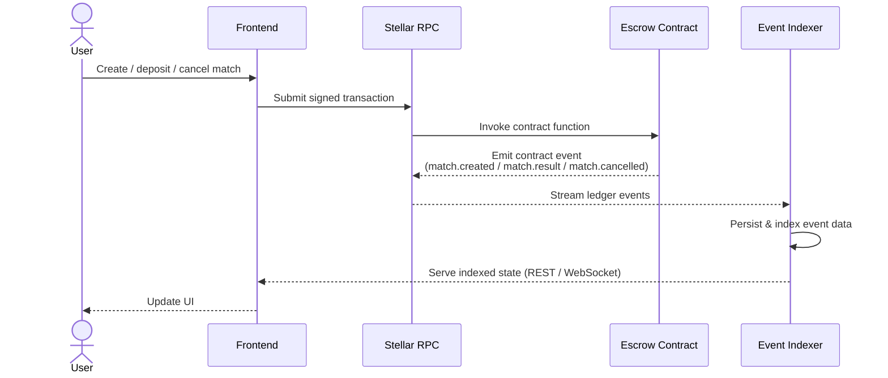
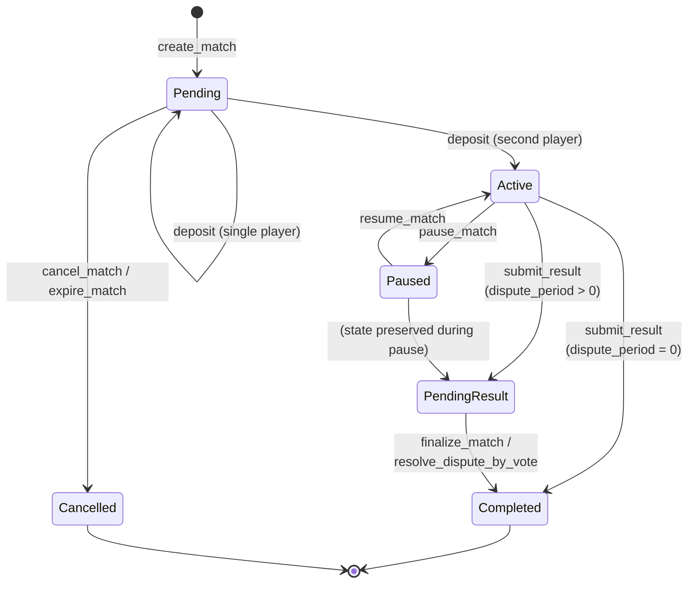

# Architecture Overview

Checkmate-Escrow is a trustless chess wagering platform built on Stellar Soroban smart contracts. This document describes the high-level architecture and the stable public API surface.

## Components

```
┌─────────────┐     create/deposit/cancel     ┌──────────────────┐
│   Players   │ ─────────────────────────────▶│  Escrow Contract │
└─────────────┘                               └────────┬─────────┘
                                                       │ submit_result
┌─────────────┐     verify game result                 │
│   Oracle    │ ─────────────────────────────▶─────────┘
└─────────────┘
      │
      │ polls
      ▼
┌──────────────────────┐
│  Lichess / Chess.com │
└──────────────────────┘
```

- **Escrow Contract** (`contracts/escrow`): Holds player stakes, enforces match lifecycle, and executes payouts.
- **Oracle Contract** (`contracts/oracle`): Bridges external chess platform APIs to the escrow contract, submitting verified match results on-chain.

## Event Flow



## Match Lifecycle

### State Machine Diagram



### Comprehensive Transition Reference

**Generated from formal specification: `/contracts/escrow/formal_spec.json`**

| From | To | Entry Point | Authorized Caller | Preconditions | Field Mutations | Key Errors |
|---|---|---|---|---|---|---|
| N/A | `Pending` | `create_match` | `player1` | Contract ¬paused; stake > 0; game_id unique; token allowed (if enforced); player1 ≠ player2; both players tier-compatible | id, player1, player2, stake_amount, token, game_id, platform, state=Pending, created_ledger | `ContractPaused`, `InvalidAmount`, `DuplicateGameId`, `InvalidGameId`, `InvalidPlayers`, `TokenNotAllowed` |
| `Pending` | `Pending` | `deposit` | player1 or player2 | Contract ¬paused; match exists; caller ¬deposited; tier-compatible | player1_deposited OR player2_deposited (one set true) | `ContractPaused`, `InvalidState`, `Unauthorized`, `AlreadyFunded` |
| `Pending` | `Active` | `deposit` | player1 or player2 | Same as Pending→Pending + both deposits now true | player1_deposited=true, player2_deposited=true, state=Active | (same as single deposit) |
| `Pending` | `Cancelled` | `cancel_match` | player1 or player2 | state == Pending | state=Cancelled, completed_ledger set | `InvalidState`, `Unauthorized` |
| `Pending` | `Cancelled` | `expire_match` | anyone | state == Pending; timeout elapsed since created_ledger | state=Cancelled, completed_ledger set | `InvalidState`, `MatchNotExpired` |
| `Active` | `PendingResult` | `submit_result` | oracle | state == Active; both deposited; dispute_period > 0 | state=PendingResult, PendingWinner stored, ResultDeadline set | `Unauthorized`, `InvalidState`, `NotFunded` |
| `Active` | `Completed` | `submit_result` | oracle | state == Active; both deposited; dispute_period == 0 | state=Completed, completed_ledger set, winner set, payout executed | `Unauthorized`, `InvalidState`, `NotFunded` |
| `Active` | `Paused` | `pause_match` | player1 or player2 | state == Active; ¬paused_ledger | state=Paused, paused_ledger set | `InvalidState`, `Unauthorized` |
| `Paused` | `Active` | `resume_match` | player1 or player2 | state == Paused | state=Active (restored), total_pause_duration += (current - paused_ledger), paused_ledger cleared | `InvalidState`, `Unauthorized` |
| `PendingResult` | `Completed` | `finalize_match` | anyone | state == PendingResult; dispute deadline elapsed; no active dispute | state=Completed, payout executed, PendingWinner cleared | `InvalidState`, `DisputePeriodNotElapsed` |
| `PendingResult` | `Completed` | `resolve_dispute_by_vote` | anyone | dispute.state == Active; voting deadline elapsed; tally votes | state=Completed, dispute resolved, payout/refund executed based on vote | `DisputeNotFound`, `VotingPeriodNotElapsed` |
| `PendingResult` | `PendingResult` | `dispute_oracle_result` | player1 or player2 | state == PendingResult; dispute deadline ¬elapsed; ¬dispute exists | Dispute record created, voting period set | `MatchNotInPendingResult`, `DisputeAlreadyRaised` |
| `Completed` | `Completed` | (none) | — | Terminal state | (no mutations) | (N/A) |
| `Cancelled` | `Cancelled` | (none) | — | Terminal state | (no mutations) | (N/A) |

### 6 Match States (Formal Specification)

| State | Reachable From | Terminal | Description |
|-------|---|---|---|
| `Pending` | N/A (initial) | No | Match created; awaiting both deposits |
| `Active` | Pending | No | Both players deposited; game in progress; awaiting result |
| `PendingResult` | Active | No | Oracle submitted result; awaiting dispute resolution or finalization deadline |
| `Completed` | Active, PendingResult | **Yes** | Payout executed; match settled |
| `Cancelled` | Pending | **Yes** | Cancelled before activation or expired; stakes refunded |
| `Paused` | Active, PendingResult | No | Match paused by player (vesting/timing paused) |

### Valid State Transitions (8 Total)

1. **Pending → Active** via `deposit()` when second player deposits
2. **Pending → Cancelled** via `cancel_match()` or `expire_match()`
3. **Active → PendingResult** via `submit_result()` with dispute_period > 0
4. **Active → Completed** via `submit_result()` with dispute_period = 0
5. **Active → Paused** via `pause_match()`
6. **Paused ↔ Active** via `resume_match()` (can pause/resume multiple times)
7. **PendingResult → Completed** via `finalize_match()` or `resolve_dispute_by_vote()`
8. **Completed → Completed** (self-loop for atomicity guarantees)

### Invalid Transitions (Properly Rejected)

The contract enforces state validation at every entry point. Invalid transitions include:
- Backward transitions (e.g., Completed → Active, Cancelled → Pending)
- Transitions from terminal states (except self-loops)
- Cross-tree jumps (e.g., Pending → Completed)

All invalid attempts return `InvalidState` error.

## Stable Public API

The following types and contract functions are considered stable. External integrations and tooling should rely only on these.

### `Match` Struct

Returned by `get_match(match_id)`. All fields below are stable and safe to read.

| Field              | Type            | Description |
|--------------------|-----------------|-------------|
| `id`               | `u64`           | Unique match identifier. |
| `player1`          | `Address`       | Match creator (first player). |
| `player2`          | `Address`       | Invited opponent (second player). |
| `stake_amount`     | `i128`          | Amount each player stakes, in the token's smallest unit. |
| `token`            | `Address`       | Token contract address used for staking (any allowlisted Stellar Asset Contract, e.g. XLM or USDC — see [Token Support](security.md#smart-contract-limitations)). |
| `game_id`          | `String`        | External game ID from the chess platform. |
| `platform`         | `Platform`      | Chess platform: `Lichess` or `ChessDotCom`. |
| `state`            | `MatchState`    | Current lifecycle state (see below). |
| `winner`           | `Winner`        | Match outcome once completed; defaults to `Draw` until set. |
| `created_ledger`   | `u32`           | Ledger sequence at match creation. |
| `completed_ledger` | `Option<u32>`   | Ledger sequence at completion or cancellation, if applicable. |
| `vested_at`        | `Option<u64>`   | Unix timestamp at which a completed payout's vesting period ends, if the protocol config has a non-zero `vesting_duration_seconds`. `None` when vesting does not apply. |
| `player1_claimed`  | `bool`          | Whether `player1` has claimed their vested payout via `claim_vested_payout`. |
| `player2_claimed`  | `bool`          | Whether `player2` has claimed their vested payout via `claim_vested_payout`. |
| `conversion_rate`  | `Option<i128>`  | For multi-token matches created via `create_match_with_conversion`: the oracle-validated `token`→`token_b` conversion rate. `None` for single-token matches. |
| `token_b`          | `Option<Address>` | For multi-token matches: the second token, in which `player2`'s side of the payout is settled. `None` for single-token matches. |
| `conversion_rate_ledger` | `Option<u32>` | Ledger sequence at which `conversion_rate` was validated against the oracle price. Used to reject stale rates at payout time. |
| `paused_ledger`    | `Option<u32>`   | Ledger sequence at which `pause_match` was last called; cleared by `resume_match`. `None` when the match is not currently paused. |
| `total_pause_duration` | `u32`       | Cumulative number of ledgers the match has spent paused across all pause/resume cycles. |

> **Internal fields** — `player1_deposited` and `player2_deposited` are internal bookkeeping. Use `is_funded(match_id)` to check whether a match is fully funded.

### `PlayerTier` Enum

Stake-size tiers used to gate `create_match`/`deposit` (both players must satisfy the tier bounds for the match's `stake_amount`) and returned by `tier_from_match_count`.

| Variant | Meaning |
|---------|---------|
| `Bronze` | Default tier; lowest stake bounds (`min_tier_stake`/`max_tier_stake`). |
| `Silver` | Unlocked after enough completed matches; wider stake bounds than `Bronze`. |
| `Gold` | Wider stake bounds than `Silver`. |
| `Platinum` | Highest tier; no upper stake bound (`max_tier_stake` returns `i128::MAX`). |

A player's tier is derived from their completed-match count (`tier_from_match_count`), not stored directly on `Match` or a player record.

### `DisputeState` Enum

| Variant | Meaning |
|---------|---------|
| `Active` | Dispute raised via `dispute_oracle_result`; voting window open. |
| `Upheld` | Reserved for future use; not currently assigned by `resolve_dispute_by_vote` (see `ResolvedUpheld`). |
| `Overturned` | Reserved for future use; not currently assigned by `resolve_dispute_by_vote` (see `ResolvedOverturned`). |
| `ResolvedUpheld` | Voting concluded; majority upheld the oracle's original result. |
| `ResolvedOverturned` | Voting concluded; majority overturned the oracle's result (settled as a `Draw` refund — the match itself still transitions to `Completed`, not `Cancelled`). |

### `Dispute` Struct

Returned by `get_dispute(dispute_id)`.

| Field | Type | Description |
|-------|------|-------------|
| `id` | `u64` | Unique dispute identifier. |
| `match_id` | `u64` | The match this dispute contests. |
| `disputer` | `Address` | Player (`player1` or `player2`) who raised the dispute. |
| `created_ledger` | `u32` | Ledger sequence when the dispute was raised. |
| `voting_deadline` | `u32` | Ledger sequence after which `resolve_dispute_by_vote` becomes callable. |
| `state` | `DisputeState` | Current dispute state. |
| `evidence_hash` | `String` | Caller-supplied hash referencing off-chain evidence for the dispute. |
| `uphold_votes` | `u32` | Unused by current voting logic; retained on the struct but not mutated by `vote_on_dispute` (see `yes_votes`/`no_votes`). |
| `overturn_votes` | `u32` | Unused by current voting logic; retained on the struct but not mutated by `vote_on_dispute` (see `yes_votes`/`no_votes`). |
| `yes_votes` | `u32` | Token-balance-weighted votes to overturn, accumulated by `vote_on_dispute`. |
| `no_votes` | `u32` | Token-balance-weighted votes to uphold, accumulated by `vote_on_dispute`. |

### `ProtocolConfig` Struct

Set via `set_protocol_config`, read via `get_protocol_config`.

| Field | Type | Description |
|-------|------|-------------|
| `vesting_duration_seconds` | `u64` | Seconds a completed payout must vest before `claim_vested_payout` releases it. `0` disables vesting (payout is immediate at `submit_result`/`finalize_match`/`resolve_dispute_by_vote` time). |
| `cancellation_fee_basis_points` | `u32` | Basis-point fee deducted on cancellation, if configured. |
| `treasury` | `Address` | Recipient address for cancellation fees. |

### `PlayerBalanceSnapshot` Struct

An internal per-player storage record — not returned directly by any function — underlying `get_balance_at_timestamp(player, timestamp) -> i128`, which walks these snapshots newest-first and returns the aggregate balance value from the first snapshot at or before `timestamp` (or `0` if none). A point-in-time record of a player's aggregate escrow balance across all of that player's deposit-eligible, non-terminal matches, recorded in a fixed-size per-player ring buffer (`MAX_PLAYER_SNAPSHOTS = 32`) on every deposit, payout, refund, or timeout.

| Field | Type | Description |
|-------|------|-------------|
| `player` | `Address` | The player this snapshot belongs to. |
| `index` | `u64` | Monotonically increasing position in the player's snapshot history; storage slot is `index % MAX_PLAYER_SNAPSHOTS`. |
| `ledger` | `u64` | Ledger sequence (widened to `u64`) at snapshot time. |
| `balance` | `i128` | Aggregate escrow balance attributable to the player at this point in time. |

### `MatchState` Enum

The contract uses a 6-state machine (formally verified at `/contracts/escrow/formal_spec.json`):

| Variant | Meaning | Terminal | Reachable From |
|---------|---------|----------|---|
| `Pending` | Match created; awaiting both deposits. | No | N/A (initial) |
| `Active` | Both players deposited; game in progress. | No | Pending |
| `PendingResult` | Oracle submitted result; awaiting dispute or finalization. | No | Active |
| `Completed` | Result verified and payout executed. | **Yes** | Active, PendingResult |
| `Cancelled` | Cancelled before activation or expired. | **Yes** | Pending |
| `Paused` | Match paused (vesting paused); can resume. | No | Active, PendingResult |

**Terminal State Guarantee:** Once a match reaches `Completed` or `Cancelled`, no further state changes are possible. These states are immutable and represent final settlement.

**Dispute/Voting Flow:** When `dispute_period > 0`, the `PendingResult` state allows players to dispute the oracle's result via voting before finalization. Vote tally determines whether result is upheld (→ `Completed`) or overturned (→ `Cancelled` as refund).

### `Winner` Enum

| Variant   | Meaning |
|-----------|---------|
| `Player1` | Player 1 won. |
| `Player2` | Player 2 won. |
| `Draw`    | Game ended in a draw; stakes returned to both players. |

### `SnapshotReason` Enum

| Variant     | Meaning |
|-------------|---------|
| `Created`   | Snapshot taken when match was created (`create_match` / `create_match_with_conversion`). |
| `Deposit`   | Snapshot taken after a player deposited. |
| `Paused`    | Snapshot taken when `pause_match` is called. |
| `Resumed`   | Snapshot taken when `resume_match` is called. |
| `Completed` | Snapshot taken when `submit_result` executes an immediate payout (`dispute_period == 0`). |
| `Cancelled` | Snapshot taken when a match is cancelled (`cancel_match` or `expire_match`). |
| `ResultSubmitted` | Snapshot taken when `submit_result` records a `PendingResult` (`dispute_period > 0`), before any payout. |
| `Finalized` | Snapshot taken when `finalize_match` or `resolve_dispute_by_vote` executes the deferred payout. |

### `BalanceSnapshot` Struct

Balance snapshots provide an audit trail of a match's escrow balance at key lifecycle transitions. The contract uses a fixed-size ring buffer to store these records efficiently.

| Field              | Type            | Description |
|--------------------|-----------------|-------------|
| `match_id`         | `u64`           | The match this snapshot belongs to. |
| `index`            | `u32`           | Monotonically increasing position in the full chronological sequence. Storage keys are computed as `slot = index % MAX_SNAPSHOTS_PER_MATCH` (8). May have gaps if older snapshots were pruned. |
| `reason`           | `SnapshotReason`  | Lifecycle event that triggered the snapshot: `Created`, `Deposit`, `Completed`, or `Cancelled`. |
| `ledger`           | `u32`           | Ledger sequence at snapshot time. |
| `token`            | `Address`       | Token contract address used for staking. |
| `token_symbol`     | `String`        | Human-readable token symbol (e.g., "XLM", "USDC"). |
| `stake_amount`     | `i128`          | Per-player stake amount at snapshot time. |
| `escrow_balance`   | `i128`          | Total tokens held in escrow at snapshot time. |
| `player1_deposited`| `bool`          | Whether player1 had deposited. |
| `player2_deposited`| `bool`          | Whether player2 had deposited. |

### Balance Snapshots

Snapshots are recorded automatically at key lifecycle transitions:
- **`Created`** — when `create_match` is called (initial state: zero deposits)
- **`Deposit`** — each time a player deposits their stake
- **`Completed`** — when `submit_result` executes the payout
- **`Cancelled`** — when cancellation occurs (before or after activation)

The ring buffer has a fixed capacity of `MAX_SNAPSHOTS_PER_MATCH = 8` slots per match. Snapshots are stored at keys `DataKey::Snapshot(match_id, slot)` where `slot = index % MAX_SNAPSHOTS_PER_MATCH`. When the buffer fills, the oldest entry is silently overwritten — this is the storage-pruning mechanism.

**Interpreting the `index` field:** The `index` is monotonically increasing and never resets, enabling callers to detect when pruning has occurred. If `get_balance_snapshots` returns snapshots with indices like `[5, 6, 7, 8]`, you know snapshots `0` through `4` were pruned because only 8 slots are retained. The `SnapshotCount(match_id)` tracks the total ever recorded, allowing calculation of the actual sequence range.

### Contract Functions

This section lists the complete public function surface of `EscrowContract` (`contracts/escrow/src/lib.rs`). Every `pub fn` in the contract's `#[contractimpl]` block appears in exactly one table below.

#### Admin & Lifecycle

| Function | Signature | Description |
|----------|-----------|-------------|
| `initialize` | `(oracle: Address, admin: Address)` | One-time setup; stores the oracle and admin addresses. Panics (does not return `Error`) if called a second time — see [Panic vs Error Behavior](security.md#panic-vs-error-behavior). |
| `is_initialized` | `() -> bool` | Returns whether `initialize` has been called. |
| `pause` | `()` | Admin-only. Halts `create_match`, `deposit`, and `submit_result` contract-wide. See [Pause Mechanism](security.md#pause-mechanism). |
| `unpause` | `()` | Admin-only. Reverses `pause`. |
| `is_paused` | `() -> bool` | Returns the current contract-wide pause state. |
| `get_admin` | `() -> Address` | Returns the stored admin address. |
| `propose_admin` | `(new_admin: Address)` | Admin-only. First step of the two-step admin transfer; stores a pending admin. |
| `accept_admin` | `()` | Called by the pending admin to complete a `propose_admin` transfer. |
| `transfer_admin` | `(new_admin: Address)` | Admin-only. One-step admin transfer (no accept step), distinct from the `propose_admin`/`accept_admin` pair. |
| `update_oracle` | `(new_oracle: Address)` | Admin-only. Rotates the trusted oracle address. Emits an `admin`/`oracle_up` event. |
| `get_oracle` | `() -> Address` | Returns the stored oracle address. |
| `set_protocol_config` | `(config: ProtocolConfig)` | Admin-only. Sets vesting duration, cancellation fee, and treasury address (see `ProtocolConfig` below). |
| `get_protocol_config` | `() -> ProtocolConfig` | Returns the current protocol configuration. |
| `set_match_timeout` | `(timeout: u32)` | Admin-only. Sets the pending-match expiration timeout, in ledgers. Must be within `[MIN_MATCH_TIMEOUT_LEDGERS, MAX_MATCH_TIMEOUT_LEDGERS]` = `[17,280, 1,555,200]` or returns `Error::InvalidTimeout`. See [Known Limitations](security.md#smart-contract-limitations). |
| `get_match_timeout` | `() -> u32` | Returns the currently effective match timeout (configured value, or `DEFAULT_MATCH_TIMEOUT_LEDGERS` = 518,400 if never set). |

#### Token Allowlist

| Function | Signature | Description |
|----------|-----------|-------------|
| `add_allowed_token` | `(token: Address)` | Admin-only. Adds `token` to the allowlist and enables allowlist enforcement. |
| `remove_allowed_token` | `(token: Address)` | Admin-only. Removes `token` from the allowlist. |
| `is_token_allowed` | `(token: Address) -> bool` | Returns whether `token` is accepted (always `true` if enforcement is not yet enabled). |
| `is_allowlist_enforced` | `() -> bool` | Returns whether allowlist enforcement has been turned on. |
| `get_allowed_tokens` | `() -> Vec<Address>` | Returns all currently allowlisted tokens. |

#### Match Management

| Function | Signature | Description |
|----------|-----------|-------------|
| `create_match` | `(player1: Address, player2: Address, stake_amount: i128, token: Address, game_id: String, platform: Platform) -> u64` | Creates a new single-token match and returns its ID. |
| `create_match_with_conversion` | `(player1: Address, player2: Address, stake_amount: i128, token_a: Address, token_b: Address, rate: i128, game_id: String, platform: Platform) -> u64` | Creates a multi-token match: `player1` stakes `token_a`, `player2` stakes the equivalent in `token_b` at `rate`, validated against the oracle contract's `get_rate` within a ±5% tolerance (see [oracle.md](oracle.md#contract-function-reference) and [Roadmap v1.0.1](roadmap.md#v101--multi-token-conversion-rate-hardening-complete)). |
| `get_match` | `(match_id: u64) -> Match` | Returns the current state of a match. |
| `cancel_match` | `(match_id: u64, caller: Address)` | Cancels a `Pending` match and refunds any deposits (minus the configured cancellation fee, if any). |
| `expire_match` | `(match_id: u64)` | Anyone may call once a `Pending` match's timeout has elapsed since `created_ledger`; cancels and refunds like `cancel_match`. |
| `pause_match` | `(match_id: u64, caller: Address)` | Either player may pause an `Active` or `PendingResult` match. |
| `resume_match` | `(match_id: u64, caller: Address)` | Either player may resume a `Paused` match, restoring its prior state and accumulating `total_pause_duration`. |

#### Escrow

| Function | Signature | Description |
|----------|-----------|-------------|
| `deposit` | `(match_id: u64, player: Address)` | Deposits the caller's stake into escrow. |
| `get_escrow_balance` | `(match_id: u64) -> i128` | Returns the total escrowed balance for a match. |
| `is_funded` | `(match_id: u64) -> bool` | Returns `true` when both players have deposited. |
| `get_depositor_count` | `(match_id: u64) -> u32` | Returns how many of the two players (0, 1, or 2) have deposited. |
| `claim_vested_payout` | `(match_id: u64, player: Address)` | For matches settled under a non-zero `vesting_duration_seconds`: releases `player`'s share once the vesting period (tracked via `vested_at`) has elapsed. Returns `Error::Overflow` on timestamp arithmetic overflow. |

#### Oracle, Payouts & Disputes

| Function | Signature | Description |
|----------|-----------|-------------|
| `submit_result` | `(match_id: u64, winner: Winner)` | Oracle submits the verified match result. If `dispute_period == 0`, payout (or draw refund) executes atomically in the same call. If `dispute_period > 0`, the match moves to `PendingResult` and payout is deferred to `finalize_match` or `resolve_dispute_by_vote`. |
| `submit_result_with_oracle_record` | `(match_id: u64, winner: Winner, game_id: String) -> Result<(), Error>` | Same as `submit_result`, additionally storing `game_id` under `DataKey::OracleRecord(match_id)` as an audit-trail cross-reference to the oracle contract's `ResultEntry`. |
| `finalize_match` | `(match_id: u64)` | Anyone may call once a `PendingResult` match's dispute deadline has elapsed with no active dispute; executes the deferred payout. |
| `dispute_oracle_result` | `(match_id: u64, disputer: Address, evidence_hash: String) -> u64` | Either player may raise a dispute on a `PendingResult` match before the dispute deadline, opening a voting window. Returns the new dispute ID. |
| `vote_on_dispute` | `(dispute_id: u64, voter: Address, vote: bool)` | Any address holding a positive balance of the match's stake token may cast one token-balance-weighted vote (`true` = overturn) before `voting_deadline`. |
| `resolve_dispute_by_vote` | `(dispute_id: u64)` | Anyone may call once the voting deadline has elapsed; tallies `yes_votes`/`no_votes` and executes payout — upheld pays the original winner, overturned pays out a `Draw` refund. The match state becomes `Completed` in both outcomes (see `DisputeState` below). |
| `set_dispute_period` | `(period: u32)` | Admin-only. Sets the dispute window (in ledgers) applied to future `submit_result` calls. `0` disables the dispute flow (immediate payout). |
| `get_dispute_period` | `(&Env) -> u32` | Returns the currently configured dispute period. |
| `get_dispute` | `(dispute_id: u64) -> Dispute` | Returns the stored dispute record. |
| `get_match_dispute_id` | `(match_id: u64) -> u64` | Returns the dispute ID associated with a match, if one has been raised. |

#### Player Tiers

| Function | Signature | Description |
|----------|-----------|-------------|
| `tier_from_match_count` | `(player: Address) -> PlayerTier` | Derives a player's current tier from their completed-match count. |
| `min_tier_stake` | `(tier: PlayerTier) -> i128` | Returns the minimum `stake_amount` permitted for a given tier. |
| `max_tier_stake` | `(tier: PlayerTier) -> i128` | Returns the maximum `stake_amount` permitted for a given tier (`i128::MAX` for `Platinum`, i.e. unbounded). |

#### Read Indexes

| Function | Signature | Description |
|----------|-----------|-------------|
| `get_match_count` | `() -> u64` | Returns the total number of matches ever created. |
| `get_player_matches` | `(player: Address) -> Vec<u64>` | Returns all match IDs (past and present) for a player. |
| `get_player_matches_paginated` | `(player: Address, offset: u32, limit: u32) -> Vec<u64>` | Paginated version of `get_player_matches`. |
| `get_pending_matches` | `() -> Vec<Match>` | Returns pending matches currently in `Pending` state, awaiting deposit completion. |
| `get_active_matches` | `() -> Vec<Match>` | Returns active matches currently in `Active` state, fully funded and ready for result submission. |
| `get_live_matches` | `() -> Vec<Match>` | **Currently an alias for `get_active_matches`** — despite the name, it does not include `Pending`, `PendingResult`, or `Paused` matches. Treat as equivalent to `get_active_matches` until/unless the implementation diverges. |
| `get_pending_matches_paginated` | `(player: Address, offset: u32, limit: u32) -> Vec<Match>` | Paginated version of `get_pending_matches`. |
| `get_active_matches_paginated` | `(offset: u32, limit: u32) -> Vec<Match>` | Paginated version of `get_active_matches`. |
| `get_live_matches_paginated` | `(offset: u32, limit: u32) -> Vec<Match>` | Alias for `get_active_matches_paginated` (see `get_live_matches` note above). |

#### Balance Snapshot Queries

| Function | Signature | Description |
|----------|-----------|-------------|
| `get_balance_snapshots` | `(caller: Address, match_id: u64) -> Vec<BalanceSnapshot>` | Returns all retained snapshots for a match. Admin sees exact amounts; players see redacted amounts. |
| `get_latest_snapshot` | `(caller: Address, match_id: u64) -> BalanceSnapshot` | Returns the most recent snapshot for a match. Same access rules as `get_balance_snapshots`. |
| `get_balance_at_timestamp` | `(player: Address, timestamp: u64) -> i128` | Returns `player`'s aggregate escrow balance as of the most recent `PlayerBalanceSnapshot` at or before `timestamp` (see `PlayerBalanceSnapshot` below), or `0` if none exists. |

## Index Behavior, TTL Caveats, and Pagination

### Player-Match Index (`get_player_matches`)

`get_player_matches` reads a `Vec<u64>` stored under `DataKey::PlayerMatches(player)` in persistent storage. The index is append-only: a match ID is added when `create_match` is called and is **never removed**, regardless of the match outcome. This means:

- The list grows monotonically over a player's lifetime.
- It includes `Completed` and `Cancelled` matches as well as live ones.
- To determine a match's current state, call `get_match(match_id)` for each ID.

### Pending-Match Query (`get_pending_matches`)

`get_pending_matches` scans all created matches and returns those currently in `Pending` state. A pending match has been created but has not yet reached full funding; it may have zero, one, or both deposits recorded, but it remains pending until the second player deposits.

### Active-Match Query (`get_active_matches`)

`get_active_matches` scans all created matches and returns those currently in `Active` state. An active match is fully funded and ready for result submission. It excludes pending, completed, and cancelled matches.

> **Note:** Because these query methods scan per-match storage, off-chain consumers should still verify a match's current state with `get_match(match_id)` before taking critical action.

### TTL Caveats

`get_player_matches` is a persistent append-only index stored under `DataKey::PlayerMatches(player)`. The index is updated on `create_match` and carries a TTL of `MATCH_TTL_LEDGERS` (~30 days at 5 s/ledger). If no matches are created or resolved for a player for ~30 days, that player-specific index may expire and `get_player_matches` can return an empty list.

`get_pending_matches` and `get_active_matches` are filtered getters that scan all `Match` records by state. They do not rely on separate persistent index entries and therefore reflect current match state directly from stored match data.

Individual `Match` records in persistent storage follow the same ~30-day TTL and are extended on every write to that match.

Off-chain indexers should not rely solely on these on-chain values for long-term history. Subscribe to contract events (`match.created`, `match.result`, `match.cancelled`) for a durable record.

### Pagination

`get_pending_matches` and `get_active_matches` return the full filtered result set in a single call. Use `get_pending_matches_paginated(player, offset, limit)` or `get_active_matches_paginated(offset, limit)` to fetch bounded pages of pending or active matches respectively.

`get_player_matches` also returns the full vector of match IDs for a player. For large player histories, apply client-side slicing on the returned `Vec<u64>`.

```rust
// Example: fetch page of 20 starting at offset 40
let all_ids = client.get_player_matches(&player);
let page: Vec<u64> = all_ids.iter().skip(40).take(20).collect();
```

## Glossary

> For the complete project glossary — escrow, oracle, match lifecycle states, Soroban, XLM, stake, payout, draw, wave-ready, `game_id`, allowlist, admin, epoch, ledger, Freighter, and more — see [docs/glossary.md](glossary.md). A few architecture-specific terms are summarized below.

- **Ledger**: A single batch of transactions finalized by the Stellar network. In this project, ledger sequence numbers are used to record when matches were created, completed, or cancelled, and to enforce time-based rules such as match expiry.
- **TTL**: Time-to-live, expressed in ledgers. In Soroban, TTL controls how long contract data remains valid in storage before it expires. The project uses ledger-based TTL values for match and index records.
- **Instance Storage**: Contract-level storage shared by a single deployed contract instance. It is used for configuration that should persist for the lifetime of the contract, such as the oracle address or other contract-wide settings.
- **Persistent Storage**: Long-lived contract data storage on-chain, retained across transactions until it expires or is overwritten. Match records, player indexes, and balance snapshots are stored here.
- **Oracle**: An authorized off-chain service or contract account that submits verified game outcomes to the escrow contract. In this system, the oracle is the trusted bridge between external chess-platform data and on-chain settlement.
- **Escrow**: The smart contract logic and funds that hold player stakes until a match reaches a terminal state. The escrow enforces the rules for deposits, cancellation, and payout settlement.
- **Match**: A single wagered chess game between two players. A match includes the participants, stake amount, token, game identifier, lifecycle state, and outcome information.
- **Payout**: The transfer of escrowed funds to the winning player after a match result is accepted, or the return of funds in a draw or cancellation scenario.
- **Wave**: A higher-level grouping or lifecycle concept in the project’s broader product model, referring to a batch of related match activity or coordinated release behavior in documentation and product discussions.

