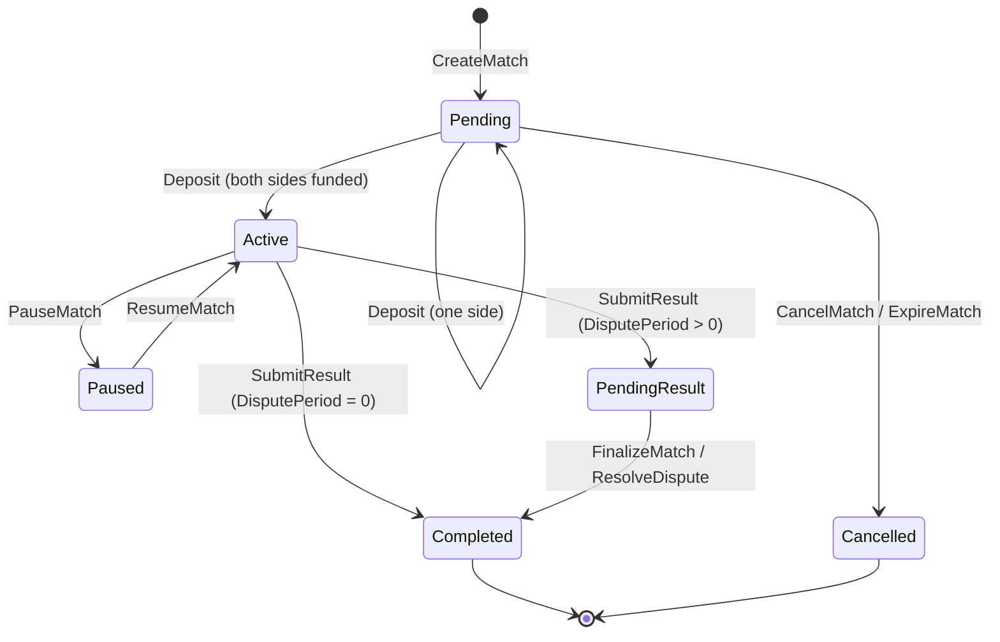

# TLA+ Formal Specification — Match State Machine

Machine-checked specification of the escrow match lifecycle, written in TLA+ and
verified with the TLC model checker.

**Specification:** [`specs/tla/MatchStateMachine.tla`](../specs/tla/MatchStateMachine.tla)
**Models:** [`specs/tla/MatchStateMachine.cfg`](../specs/tla/MatchStateMachine.cfg),
[`specs/tla/MatchStateMachineDeferred.cfg`](../specs/tla/MatchStateMachineDeferred.cfg)
**Runner:** `scripts/check_tla.sh`
**Last checked:** 2026-07-27, TLC 2.19 (tla2tools v1.7.4) on OpenJDK 25

---

## Why TLA+ in addition to Kani

[`docs/formal-verification.md`](formal-verification.md) covers the Kani harness,
which reasons about **one call at a time**: given a match in some state, does
this function preserve the invariant? That is the right tool for arithmetic,
overflow and per-call authorisation.

What Kani does not explore is **interleaving**: sequences of calls across
multiple matches and multiple ledgers. The bugs that live there are ordering
bugs — completing a match twice through two different code paths, a state that
reopens after it was final, a payout route that becomes enabled a second time
after a dispute. TLA+ enumerates every reachable sequence of calls within a
bounded model, which is exactly the coverage the Kani harness cannot give.

The two are complementary, not redundant:

| Question | Tool |
|----------|------|
| Can this arithmetic overflow? | Kani |
| Can a non-oracle submit a result? | Kani |
| Can two different payout routes both fire for one match? | TLC |
| Can a completed match go back to active? | TLC |
| Is escrow conserved across every call ordering? | TLC |

---

## What the model covers

The spec models the escrow lifecycle of a set of matches: creation, deposits,
activation, result submission, the dispute window, finalisation, dispute
resolution, pausing, cancellation and expiry — plus the escrowed balance and who
is entitled to it.

Each action corresponds to one contract entry point in
`contracts/escrow/src/lib.rs`:

| TLA+ action | Contract function | Guard |
|-------------|-------------------|-------|
| `CreateMatch` | `create_match` | id unused |
| `Deposit` | `deposit` | state Pending, player has not funded |
| `SubmitResult` | `submit_result` | state Active, both funded |
| `ReleasePot` | `claim_vested_payout` | state Completed, pot unreleased |
| `FinalizeMatch` | `finalize_match` | state PendingResult, deadline passed |
| `ResolveDispute` | `resolve_dispute_by_vote` | state PendingResult |
| `CancelMatch` | `cancel_match` | state Pending |
| `ExpireMatch` | `expire_match` | state Pending, timeout elapsed |
| `PauseMatch` | `pause_match` | state Active |
| `ResumeMatch` | `resume_match` | state Paused |
| `Tick` | ledger close | clock below the model bound |

### State space



Note the two payout routes this diagram makes visible:

- **DisputePeriod = 0** — `submit_result` marks the match Completed but moves no
  funds; the pot is released later by `claim_vested_payout`.
- **DisputePeriod > 0** — the result is parked as pending and the pot is released
  *inside* `finalize_match` or `resolve_dispute_by_vote`.

Both routes are modelled in the same spec, which is what lets TLC check that no
call ordering can fire both for one match.

### Non-goals

Deliberately abstracted away, and why that keeps the safety results sound:

- **Authorisation.** Every action is modelled as callable whenever its state
  guard holds. This is *more* permissive than the contract, so any invariant
  that survives here survives under the real authorisation checks too. Who may
  sign is verified by the Kani harness instead.
- **Token arithmetic.** Fees, multi-token conversion rates and vesting durations
  are out of scope; the pot is one integer amount of one token so that
  conservation is expressible.
- **Dispute voting mechanics.** Quorum, bonds and vote weights are not modelled.
  `ResolveDispute` may return *any* outcome, including one that overturns the
  oracle — again an over-approximation of the real vote.
- **Storage TTL and archival.** Modelled as never expiring.

---

## Invariants

Two invariants were called out as the reason for this work; the spec checks
those plus nine more that fell out of writing it down.

### INV-1 — A match can only complete once

```tla
AtMostOneRelease == \A m \in Matches : released[m] <= 1
```

`released` counts pot releases through *every* route: the vesting claim,
finalisation, dispute resolution, cancellation and expiry. Counting refunds in
the same variable is what makes the check cover mixed orderings — refund then
payout, or finalise then claim — and not just a repeat of the same call.

Reinforced by two action properties:

```tla
TerminalIsFinal    == [][ \A m \in Matches : state[m] \in Terminal => state'[m] = state[m] ]_vars
ReleaseIsMonotonic == [][ \A m \in Matches : released'[m] >= released[m] ]_vars
```

Together these rule out the "complete, reopen, complete again" shape that a
counter alone would miss.

### INV-2 — Both players cannot both be winners

```tla
NotBothPlayersWin == \A m \in Matches : ~(Players \subseteq winners[m])
AtMostOneWinner   == \A m \in Matches : Cardinality(winners[m]) <= 1
```

This is only a real property because a **draw is modelled as a refund, not as a
double win**: `Entitled("draw") = {}` and both players are repaid their own
stake. Had a draw been modelled as both players winning, the invariant would
have been vacuously unprovable and the modelling would have hidden the
distinction that matters — one pot, at most one claimant on it.

### The remaining invariants

| Name | Statement |
|------|-----------|
| `TypeOK` | Every variable stays in its declared domain |
| `WinnersMatchOutcome` | The winner set always equals the entitlement implied by the recorded outcome |
| `NoOutcomeBeforeCompletion` | An outcome is recorded only on a Completed match |
| `EscrowMatchesDeposits` | Unreleased escrow holds exactly one stake per depositor; released escrow is empty |
| `OnlyDepositorsArePaid` | Only players who funded a match can receive funds from it |
| `PlayingImpliesFullyFunded` | Active, Paused and PendingResult all imply both stakes are escrowed |
| `NoPayoutWithoutFullFunding` | A result-driven payout implies both players funded |
| `PendingMatchIsNeverPaused` | A pending match has zero accumulated pause time (see Finding 1) |
| `OutcomeIsStable` | Once recorded, an outcome never changes |

---

## Results

Both models were checked exhaustively. **No invariant or property violation was
found**, i.e. no counter-example exists within the bounds below.

### Model 1 — immediate completion

`Matches = {m1, m2}`, `Players = {p1, p2}`, `Stake = 1`, `DisputePeriod = 0`,
`Timeout = 2`, `MaxLedger = 3`

| Metric | Value |
|--------|-------|
| States generated | 43,382 |
| Distinct states | 17,108 |
| Search depth | 18 |
| Violations | 0 |
| Wall clock | 3 s |

### Model 2 — deferred completion (dispute window open)

`Matches = {m1, m2}`, `Players = {p1, p2}`, `Stake = 1`, `DisputePeriod = 1`,
`Timeout = 2`, `MaxLedger = 4`

| Metric | Value |
|--------|-------|
| States generated | 810,881 |
| Distinct states | 340,317 |
| Search depth | 19 |
| Violations | 0 |
| Wall clock | 10 s |

### Are the invariants actually load-bearing?

"No violations found" is only meaningful if the checks *can* fail. Four
deliberate mutations of the spec were checked to confirm each class of property
is enforced. All four were caught:

| Mutation | Caught by |
|----------|-----------|
| Remove the release guards so the pot can be paid twice | `AtMostOneRelease` violated |
| Award the pot to both players on dispute resolution | `NotBothPlayersWin` violated |
| Let a Completed match be cancelled | `NoOutcomeBeforeCompletion` violated |
| Let a Completed match be re-resolved with a new outcome | `OutcomeIsStable` violated (action property) |

The last one matters procedurally: it confirms the `PROPERTIES` section of the
model configuration is being evaluated, not silently ignored.

### Bounds and what they mean

The results hold **within these bounds**, which is the standard caveat for
bounded model checking:

- **Two matches.** Per-match state is fully indexed by match id and no action
  reads another match's state, so a third match adds states without adding
  behaviours. Two is enough to expose any cross-match interference that does
  exist.
- **A clock of 3–4 ledgers.** Long enough for a dispute deadline to pass and for
  the expiry timeout to elapse, which is what the guards depend on. Absolute
  ledger values are never compared against anything but these deltas.
- **`Stake = 1`.** Conservation is checked structurally
  (`escrow = Stake * |deposits|`), so the magnitude is irrelevant. Overflow at
  realistic magnitudes is a Kani property, not a TLC one.

---

## Findings

No safety violation was found. Two structural findings came out of writing the
spec; both are recorded here rather than fixed, because neither is a bug and
both are now pinned by a check that will fail if the state machine changes
underneath them.

### Finding 1 — the pause adjustment in `expire_match` is unreachable

`expire_match` computes the elapsed time as
`(current_ledger - created_ledger) - total_pause_duration`, excluding paused time
from the expiry timeout. But `total_pause_duration` is only ever incremented by
`resume_match`, `pause_match` requires the Active state, and **no transition
returns a match to Pending**. A match that can be expired has therefore always
spent zero ledgers paused, and the subtraction is always subtracting zero.

Verified by the model as `PendingMatchIsNeverPaused`, which holds in both models.

- **Impact:** none today — the code is correct, just dead in this path.
- **Action:** left in place. It is cheap, defensive, and would be needed if a
  future change ever admitted an Active → Pending edge. The invariant now
  documents the dependency: introduce such an edge and this check fails,
  flagging that the expiry timeout semantics need thought.

### Finding 2 — Paused has no timeout escape

The only transition out of Paused is `resume_match`. `expire_match` applies to
Pending only, and `submit_result` requires Active. Two players who pause an
active match and never resume it leave both stakes in escrow indefinitely.

Verified by the model as the action property `PausedIsOnlyLeftByResume`.

- **Impact:** requires both players to be uncooperative or unavailable, and it
  only affects their own stakes — no third party's funds are at risk. Pausing is
  a consensual feature and today's behaviour is intentional.
- **Action:** documented, not changed. Adding a maximum pause duration would be
  a behaviour change with its own dispute implications, and belongs in its own
  issue rather than being smuggled into a specification PR. If it is ever added,
  `PausedIsOnlyLeftByResume` is the property to update.

---

## Running the checker

```bash
# Check every model in specs/tla (downloads tla2tools.jar on first run)
scripts/check_tla.sh

# Check one model
scripts/check_tla.sh MatchStateMachine.cfg

# Use an existing copy of the tools instead of downloading
TLA_TOOLS_JAR=/path/to/tla2tools.jar scripts/check_tla.sh
```

Requires Java 11 or newer. The script caches `tla2tools.jar` under
`specs/tla/.tools/` (git-ignored) so later runs need no network access.

A failing run prints the counter-example trace: the sequence of actions from the
initial state to the state that breaks the property. Read it as a call sequence
against the contract — that is the test case to add.

### Interpreting the flags

`scripts/check_tla.sh` passes `-deadlock` to TLC, which **disables** deadlock
detection. The model bounds the clock with `MaxLedger`; once every match is
terminal and the clock has stopped, no action is enabled, and TLC would report
that as a deadlock even though it is simply the end of the bounded model.
Liveness is expressed through the explicit action properties instead.

---

## Maintaining the spec

The spec is only worth its bytes if it tracks the contract. Update it when:

- **A new state or transition is added.** Add the action, add it to `Next`, and
  re-check. If an invariant fails, either the transition is wrong or the
  invariant needs to be weakened deliberately and with a reason recorded here.
- **A new payout route is added.** It must guard on `released[m] = 0` (or the
  contract's equivalent state check) and increment `released`, or
  `AtMostOneRelease` will catch it. This is the single most valuable check in
  the file.
- **A guard is relaxed.** Relaxing a guard in the contract without relaxing it
  here makes the model unsound in the dangerous direction — the spec would
  still pass while the contract has a new reachable state.

## Related documents

- [`docs/formal-verification.md`](formal-verification.md) — Kani harness, per-call invariants
- [`docs/match-lifecycle.md`](match-lifecycle.md) — the same state machine, prose
- [`docs/architecture.md`](architecture.md) — contract structure
- [`docs/dispute-governance.md`](dispute-governance.md) — dispute mechanics abstracted away here
