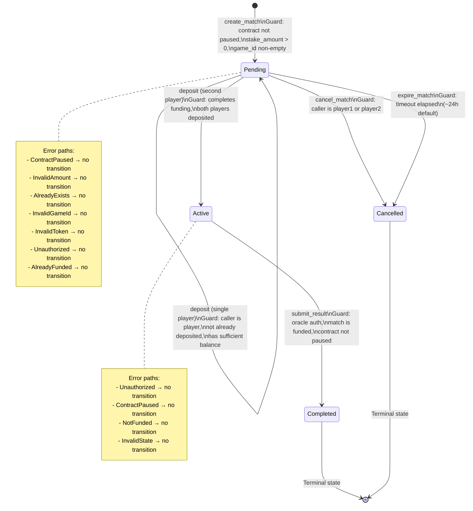

# Match Lifecycle State Machine

This document provides a detailed visualization of the match lifecycle state machine, including all state transitions, guards, error paths, and timing information.

## ASCII State Machine Diagram

```
                    ┌─────────────────────────────────────────────────────────────┐
                    │                         [*] (Start)                          │
                    └─────────────────────────────────────────────────────────────┘
                                              │
                                              │ create_match(player1, player2, 
                                              │   stake_amount, token, game_id, platform)
                                              │
                                              ▼
                    ┌─────────────────────────────────────────────────────────────┐
                    │                        Pending                               │
                    │  - player1_deposited: false                                  │
                    │  - player2_deposited: false                                  │
                    │  - created_ledger: set                                      │
                    └─────────────────────────────────────────────────────────────┘
                              │                    │                    │
                              │ deposit(p1)        │ deposit(p2)        │ cancel_match/expire
                              │                    │                    │
                              ▼                    ▼                    ▼
                    ┌─────────────────┐  ┌─────────────────┐  ┌─────────────────┐
                    │ Pending         │  │ Pending         │  │ Cancelled       │
                    │ p1: true        │  │ p2: true        │  │ - refunds       │
                    │ p2: false       │  │ p1: false       │  │ - terminal      │
                    └─────────────────┘  └─────────────────┘  └─────────────────┘
                              │                    │
                              │ deposit(p2)        │ deposit(p1)
                              │                    │
                              ▼                    ▼
                    ┌─────────────────────────────────────────────────────────────┐
                    │                         Active                               │
                    │  - player1_deposited: true                                   │
                    │  - player2_deposited: true                                   │
                    │  - escrow_balance: 2 * stake_amount                         │
                    └─────────────────────────────────────────────────────────────┘
                                              │
                                              │ submit_result(oracle, winner)
                                              │
                                              ▼
                    ┌─────────────────────────────────────────────────────────────┐
                    │                       Completed                              │
                    │  - winner: set                                               │
                    │  - completed_ledger: set                                    │
                    │  - escrow_balance: 0                                         │
                    │  - terminal state                                            │
                    └─────────────────────────────────────────────────────────────┘
```

## Mermaid State Machine Diagram



## State Transition Details

### 1. [*] → Pending: `create_match`

**Triggering Function:** `create_match(player1, player2, stake_amount, token, game_id, platform)`

**Authorized Caller:** `player1` (match creator)

**Guards:**
- Contract is not paused
- `stake_amount > 0`
- `game_id` is non-empty and unique
- Token is on allowlist (if enforced)
- `player1` and `player2` are different addresses

**Key Errors:**
- `ContractPaused` - Contract is paused by admin
- `InvalidAmount` - `stake_amount <= 0`
- `AlreadyExists` - `game_id` already used
- `InvalidGameId` - `game_id` is empty
- `InvalidToken` - Token not on allowlist
- `InvalidAddress` - Invalid player addresses

**Side Effects:**
- Creates new `Match` record with `id = match_count`
- Increments `match_count`
- Adds match ID to `player1` and `player2` match indexes
- Sets `created_ledger` to current ledger sequence

---

### 2. Pending → Pending: `deposit` (first player)

**Triggering Function:** `deposit(match_id)`

**Authorized Caller:** `player1` or `player2`

**Guards:**
- Match exists and is in `Pending` state
- Contract is not paused
- Caller has not already deposited
- Caller has sufficient token balance
- Transfer of `stake_amount` to escrow succeeds

**Key Errors:**
- `MatchNotFound` - Match does not exist
- `InvalidState` - Match not in `Pending` state
- `Unauthorized` - Caller is not a player
- `AlreadyFunded` - Caller already deposited
- `ContractPaused` - Contract is paused

**Side Effects:**
- Sets `player1_deposited` or `player2_deposited` to `true`
- Transfers `stake_amount` from caller to escrow
- Extends match TTL

---

### 3. Pending → Active: `deposit` (second player)

**Triggering Function:** `deposit(match_id)`

**Authorized Caller:** `player1` or `player2`

**Guards:**
- All guards for single deposit apply
- **AND** this deposit completes funding (both players now have `*_deposited = true`)

**Key Errors:** Same as single deposit

**Side Effects:**
- All single deposit side effects
- Sets match state to `Active`
- Adds match to `ActiveMatches` index

---

### 4. Pending → Cancelled: `cancel_match`

**Triggering Function:** `cancel_match(match_id)`

**Authorized Caller:** `player1` or `player2`

**Guards:**
- Match exists and is in `Pending` state
- Caller is `player1` or `player2`

**Key Errors:**
- `MatchNotFound` - Match does not exist
- `MatchAlreadyActive` - Match is in `Active` state
- `Unauthorized` - Caller is not a player
- `InvalidState` - Match already cancelled or completed

**Side Effects:**
- Sets match state to `Cancelled`
- Sets `completed_ledger` to current ledger sequence
- Refunds any deposited stakes to respective players
- Sets `escrow_balance` to 0

---

### 5. Pending → Cancelled: `expire_match`

**Triggering Function:** `expire_match(match_id)`

**Authorized Caller:** Anyone

**Guards:**
- Match exists and is in `Pending` state
- Ledger timeout has elapsed: `current_ledger - created_ledger >= MatchTimeout`
- Default `MatchTimeout` is ~24 hours (17,280 ledgers at 5s/ledger)

**Key Errors:**
- `MatchNotFound` - Match does not exist
- `InvalidState` - Match not in `Pending` state
- `MatchNotExpired` - Timeout has not elapsed

**Side Effects:**
- Same as `cancel_match`

---

### 6. Active → Completed: `submit_result`

**Triggering Function:** `submit_result(match_id, winner)`

**Authorized Caller:** Oracle address stored at contract initialization

**Guards:**
- Match exists and is in `Active` state
- Contract is not paused
- Both players have deposited (`is_funded(match_id) == true`)
- Oracle authentication succeeds
- Contract has sufficient token balance for payout

**Key Errors:**
- `Unauthorized` - Caller is not the oracle
- `ContractPaused` - Contract is paused
- `MatchNotFound` - Match does not exist
- `NotFunded` - Match is not fully funded
- `InvalidState` - Match not in `Active` state

**Side Effects:**
- Sets match state to `Completed`
- Sets `winner` field
- Sets `completed_ledger` to current ledger sequence
- **Executes payout atomically:**
  - If `winner == Player1`: transfers `2 * stake_amount` to `player1`
  - If `winner == Player2`: transfers `2 * stake_amount` to `player2`
  - If `winner == Draw`: transfers `stake_amount` to each player
- Sets `escrow_balance` to 0
- Removes match from `ActiveMatches` index

---

## Terminal States

### Completed
- **Meaning:** Match finished with result submitted and payout executed
- **Transitions:** None (terminal)
- **Data:** `winner` set, `completed_ledger` set, `escrow_balance = 0`

### Cancelled
- **Meaning:** Match cancelled before activation
- **Transitions:** None (terminal)
- **Data:** `completed_ledger` set, `escrow_balance = 0`, stakes refunded

---

## Error Recovery Paths

### Deposit Failure
If a deposit fails (e.g., insufficient balance), the match remains in its current state with no changes. Players can retry deposit once the issue is resolved.

### Cancel After Partial Deposit
If one player has deposited and the match is cancelled, the deposited player receives a full refund. The non-deposited player is unaffected.

### Oracle Failure
If the oracle fails to submit a result, the match remains in `Active` state indefinitely. There is currently no timeout for active matches. Players must rely on oracle reliability or admin intervention.

### Contract Pause
When the contract is paused by admin, all state transitions that require `!ContractPaused` guard will fail. Existing matches remain in their current state until the contract is unpaused.

---

## Timing Windows

| Timeout | Default Value | Description |
|---------|---------------|-------------|
| `MatchTimeout` | ~24 hours (17,280 ledgers) | Time before a pending match can be expired |
| `MATCH_TTL_LEDGERS` | ~30 days (518,400 ledgers) | TTL for match storage entries |

**Note:** Timing assumes 5 seconds per ledger on Stellar network.

---

## State Machine Invariants

1. **Match IDs are unique and monotonic:** Each new match gets `id = match_count`, and `match_count` increments by 1.

2. **Escrow balance consistency:**
   - `escrow_balance = 0` when no deposits
   - `escrow_balance = stake_amount` when one player deposited
   - `escrow_balance = 2 * stake_amount` when both deposited
   - `escrow_balance = 0` after payout or cancellation

3. **Deposit flags accuracy:** `player1_deposited` and `player2_deposited` accurately reflect whether each player has deposited.

4. **State monotonicity:** Match state progresses forward only: `Pending → Active → Completed` or `Pending → Cancelled`. No backward transitions.

5. **Player match index:** `get_player_matches(player)` returns all match IDs for a player, including completed and cancelled matches. The index is append-only and never removes entries.

---

## Cross-References

- **Implementation:** See `contracts/escrow/src/lib.rs` for state machine logic
- **Tests:** See `contracts/escrow/src/tests/lifecycle.rs` for state transition tests
- **API Reference:** See `docs/architecture.md` for stable public API
- **Error Codes:** See `docs/error-codes.md` for detailed error descriptions
